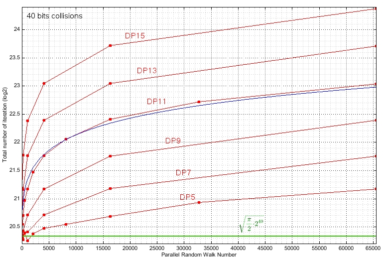
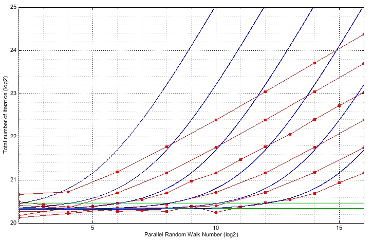

# BTCCollider

BTCCollider generates BTC p2pkh address pair (and their corresponding private keys) that 
share the same prefix. It looks for a pair of distinct HASH160 starting with the same bits 
(a partial collision) using the so called "distinguished point" method which allows 
to efficiently take benefit of the birthday paradox using parallel calculations.
BTCCollider supports multi GPU using CUDA and is based on VanitySearch enigne.

On my hardware ( GTX 1050 Ti without CPU ):

| Collision     |  Average time  | Average time (using -e) |
|----------|:-------------:|:-------------:|
| 64 bits | 2min51 | 2min51 |
| 80 bits | 15h30 | 14h30 |
| 96 bits | 201d | 180d |
| 112 bits | 165y | 145y |
| 128 bits | 48744y | 42000y |
| 144 bits | 1.4e7y | 1.18e7y |
| 160 bits | 4e9y | 3.3e9y |

# Usage

```
BTCCollider [-check] [-v] [-gpu]
            [-gpuId gpuId1[,gpuId2,...]] [-g g1x,g1y[,g2x,g2y,...]]
            [-o outputfile] [-s collisionSize] [-t nbThread] [-d dpBit]
            [-w workfile] [-i inputWorkFile] [-wi workInterval]
            [-e] [-check]

 -v: Print version
 -gpu: Enable gpu calculation
 -o outputfile: Output results to the specified file
 -gpu gpuId1,gpuId2,...: List of GPU(s) to use, default is 0
 -g g1x,g1y,g2x,g2y,...: Specify GPU(s) kernel gridsize, default is 2*(MP),2*(Core/MP)
 -s: Specify size of the collision in bit (minimum 16,default is 40)
 -d: Specify number of leading zeros for the DP method (default is auto)
 -e: Enable extra points (symetry and endomorphisms), reduce needed step by sqrt(2)
 -t threadNumber: Specify number of CPU thread, default is number of core
 -w workfile: Specify file to save work into
 -i workfile: Specify file to load work from
 -wi workInterval: Periodic interval (in seconds) for saving work
 -l: List cuda enabled devices
 -check: Check CPU and GPU kernel vs CPU
```
 
Example (Windows, Intel Core i7-4770 3.4GHz 8 multithreaded cores, GeForce GTX 1050 Ti):
```
C:\C++\BTCCollider\x64\Release>BTCCollider.exe -t 6 -gpu -s 80
BTCCollider v1.0
Collision: 80 bits
Seed: 305ABC344F924BD8B268905F99ADBD403D9A45BB220C5948731740DDE0E3A41A
Initializing:Done
Start Tue Jan 21 16:02:07 2020
Number of CPU thread: 6
Number of random walk: 2^18.59 (Max DP=20)
DP size: 20 [0xFFFFF00000000000]
GPU: GPU #0 GeForce GTX 1050 Ti (6x128 cores) Grid(12x256) (60.5 MB used)
[27.9 Mips][GPU 24.8 Mips][Cnt 2^39.44][T 07:24:33][Tavg 13:42:43][hSize 41.3MB]
Undistinguishing
DP size: 10 [0xFFC0000000000000]
DP size: 5 [0xF800000000000000]
DP size: 2 [0xC000000000000000]
DP size: 1 [0x8000000000000000]
DP size: 0 [0x0000000000000000]
[Collision Found: 82 bits][Cnt 2^39.44][T 07:24:40]
H1=FD53BD2E39ECB0F2D6AE441DE23ED586CA57C7B3
H2=FD53BD2E39ECB0F2D6AE72F3F4D6A824A065915B
Priv (WIF): p2pkh:KzNuYQf9X5sbXtr5mgEeBMx7LK2K6QRK73pMWqMhVAGpoWLEowLA
Priv (WIF): p2pkh:KzNuYQf9X5sbXtr5mgEeBMx7LK2K6QRFqBMftDEYHFzssVsN2Shn
Add1: 1Q6UGpZ6oKmCSZF1m7W1r3pp7syt1JZwMe
Add2: 1Q6UGpZ6oKmCSZFJynpzcRPJWJ2ur5Ujb5
```

# Compilation

## Windows

Install CUDA SDK and open BTCCollider.sln in Visual C++ 2017.\
You may need to reset your *Windows SDK version* in project properties.\
In Build->Configuration Manager, select the *Release* configuration.\
Build and enjoy.\
\
Note: The current release has been compiled with CUDA SDK 10.0, if you have a different release of the CUDA SDK, you may need to update CUDA SDK paths in BTCCollider.vcxproj using a text editor. The current nvcc option are set up to architecture starting at 3.0 capability, for older hardware, add the desired compute capabilities to the list in GPUEngine.cu properties, CUDA C/C++, Device, Code Generation.

## Linux

Install CUDA SDK.\
Depending on the CUDA SDK version and on your Linux distribution you may need to install an older g++ (just for the CUDA SDK).\
Edit the makefile and set up the good CUDA SDK path and appropriate compiler for nvcc. 

```
CUDA       = /usr/local/cuda-8.0
CXXCUDA    = /usr/bin/g++-4.8
```

You can enter a list of architecture (refer to nvcc documentation) if you have several GPU with different architecture. Compute capability 2.0 (Fermi) is deprecated for recent CUDA SDK.
BTCCollider need to be compiled and linked with a recent gcc (>=7). The current release has been compiled with gcc 7.3.0.\
Go to the BTCCollider directory. ccap is the desired compute capability.

```
$ g++ -v
gcc version 7.3.0 (Ubuntu 7.3.0-27ubuntu1~18.04)
$ make all (for build without CUDA support)
or
$ make gpu=1 ccap=20 all
```
Runnig BTCCollider (Intel(R) Xeon(R) CPU, 8 cores,  @ 2.93GHz, Quadro 600 (x2))
```
$export LD_LIBRARY_PATH=/usr/local/cuda-8.0/lib64
$./BTCCollider -gpu -gpuId 0,1 -s 56
BTCCollider v1.0
Collision: 56 bits
Seed: B820941A47BF7E47B67C1F0DEBEB5B422A8AF55497811A74D08A1CD69E6E17A4
Initializing:Done
Start Wed Jan 22 13:26:34 2020
Number of CPU thread: 6
Number of random walk: 2^14.63 (Max DP=12)
DP size: 12 [0xfff0000000000000]
GPU: GPU #0 Quadro 600 (2x48 cores) Grid(4x96) (43.1 MB used)
GPU: GPU #1 Quadro 600 (2x48 cores) Grid(4x96) (43.1 MB used)
[5.8 Mips][GPU 2.7 Mips][Cnt 2^28.61][T 01:10][Tavg 57 s][hSize 10.8MB]  
Undistinguishing
DP size: 6 [0xfc00000000000000]
DP size: 3 [0xe000000000000000]
DP size: 1 [0x8000000000000000]
DP size: 0 [0x0]
[Collision Found: 57 bits][Cnt 2^28.62][T 01:10]
H1=6E1A7D4635F2FC2BCD77CD3876D82CBC14102694
H2=6E1A7D4635F2FC60D084BF846A3F9A8EC5327648
Priv (WIF): p2pkh:KwYUtUYFZYiTYC1KvF5enJGmUitpL3jEAzHFmyqGFgLR9GRyVKmp
Priv (WIF): p2pkh:KwYUtUYFZYiTYC1KvF5enJGmUitpL3jEAzHFUwbG1iniUEMCA8uD
Add1: 1B3B4cbvZogP3Z7uNdNV4RUVDAND2qJcFJ
Add2: 1B3B4cbvZogswNAiYoBYNqSUEqmq7pEd1V
```

# Notes on DP method tradeoff

This picture illustrates the overhead you get according to the number of random walks running in parallel and the number of distinguished bits. All experimental points (red points) are averaged over 1000 collisions.
The green curve is the natural average of the birthday paradox without using DP method (DP0).
The total number of iteration is the total number of evaluation of the F function of all walks.
Significant overhead of memory and time (>10%) appears  when dp > n/2 - log2(nbWalk) - 3, for n bits collision.
BTCCollider compute DP using the following code, DP can be set manually using -d option:
```
int optimalDP = (int)((double)colSize / 2.0 - log2((double)totalRW) - 2);
```



The following plots in blue show the asymtotic functions: sqrt(PI/2 * 2^40) + m*2^dp where m is the number of walk.



# License

BTCCollider is licensed under GPLv3.

